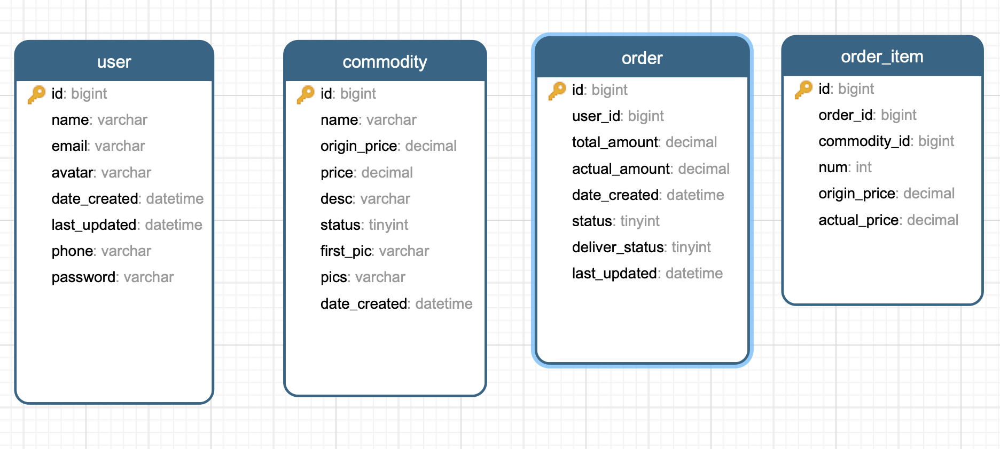

### 2、（必做）：基于电商交易场景（用户、商品、订单），设计一套简单的表结构，提交DDL的SQL文件到Github（后面2周的作业依然要是用到这个表结构）。

简单表结构如下图所示，建表语句详见[e-commerce.sql](./e-commerce.sql) 。

用户表：user

商品表：commodity

订单表：order ,每个订单包含多个订单项（多个商品）

订单项表：order_item，每个订单项对应一个商品

